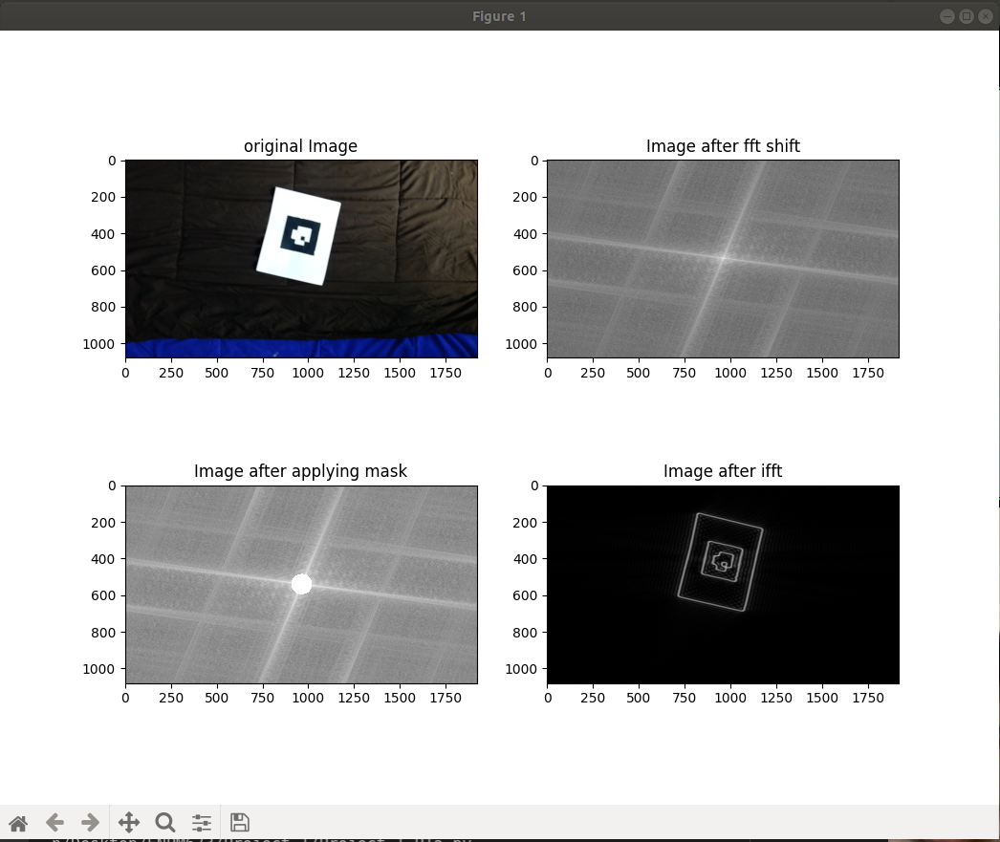
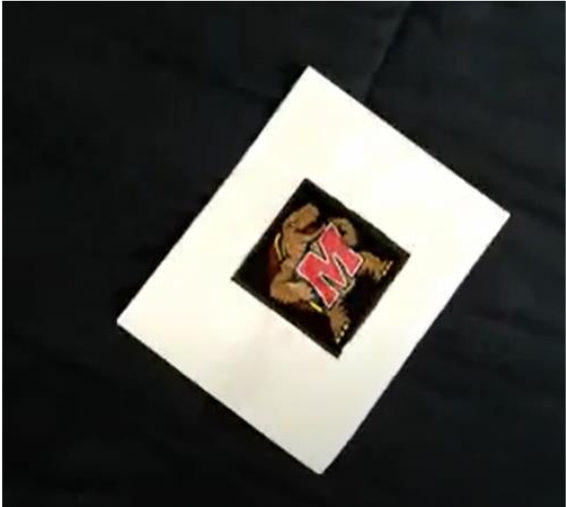
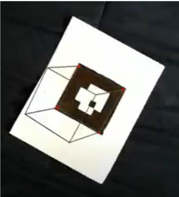

# The following folder contains programms that deal with AR tag.
1. The file [ARTag_detection.py](./ARTag_detection.py) contains the code in which we try to detect the AR tag.
2. The file [ARTag_decoding.py](./ARTag_decoding.py) contains the code in which we try to decode the AR tag.
3. The file [Testudo_on_ARTag.py](./Testudo_on_ARTag.py) is the file in which first we detect the AR tag apply warp perspective and then we apply the image of testudo on the tag and then place the AR tag on its position.
4. The file [Cube_on_ARTag.py](./Cube_on_ARTag.py) is the file in which first we detect the AR tag apply warp perspective and then we draw a cube on it and display the output
5. The link to the input video can be found here [Link](https://drive.google.com/file/d/1UCEIWNUF5Ijmx8l7SGvVJO4Metj4ZALr/view?usp=sharing).

Images of the output from various program

