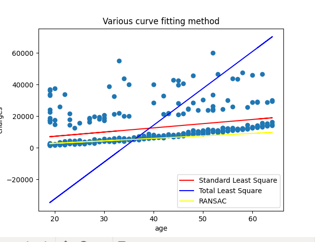
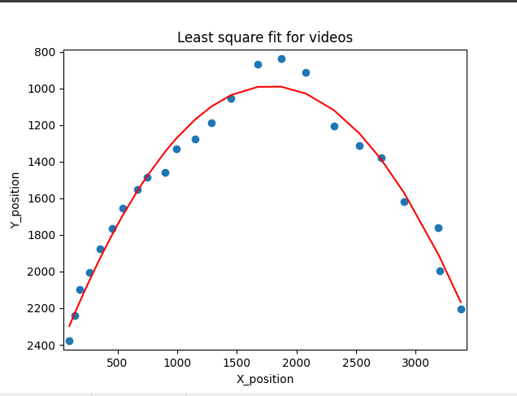

# Curve_fitting folder contains code for basic curve fitting Techniques.
1. Least square, total least square and RANSAC maethod are explored.
2. The file [data_fitting.py](./data_fitting.py) contains the code to fit data on the data for health insurance costs based on the person’s age given by [Data](./Data.csv).
3. The [Ball_Tracker.py](./Ball_Tracker.py) file inputs a video in which a red ball is thrown and tries to fit a curve on the path followed by the ball.
4. The  [SVD.py](./SVD.py) is used to calculate a homogenous matrix between four points.

## Following images show the output of the programs.

