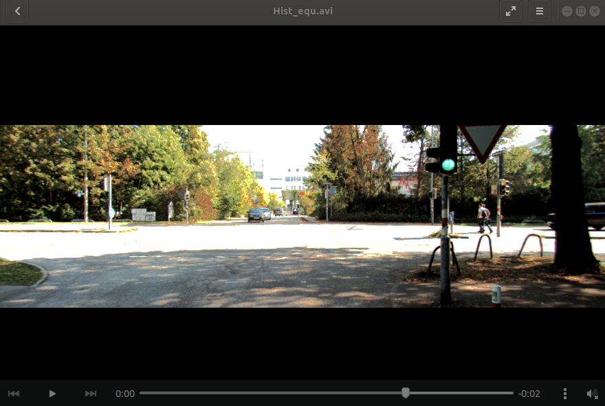
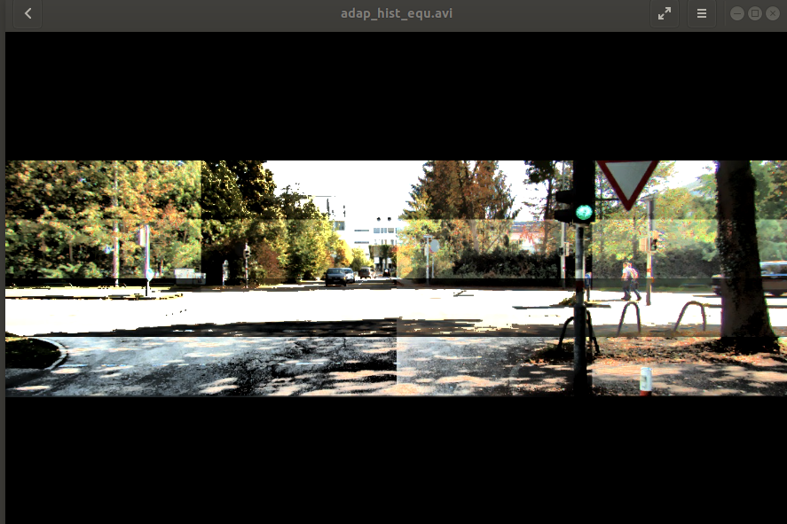

# The following folder contains programms that deal with Histogram Equalization.
1. The file [Hist_equalization.py](./Hist_equalization.py) contains the code in which we perform histogram equalization and adaptive histogram equalization.
2. Both equalization methods have been performed mathematically without using any inbuilt function.

## Images of the output from various program

