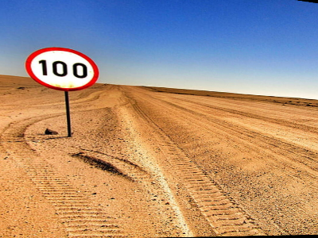
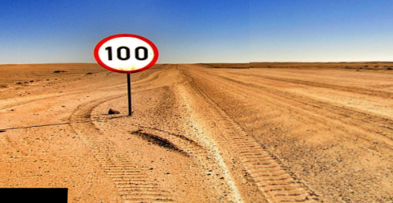

# The following folder contains the code for stitching to images.

1. The file [Stitcher.py](./Stitcher.py) contains the code in which we try to Stitch two images.
2. We have used ORB feature detector to detect features in the two images.
3. After getting the features we have used brute force method to match the common feature in the images.
4. Then we find the homography matrix on the keypoints between the images and apply warp perspective to stitch the images. 

## Images of the output from the program
### Input images

### Output image
